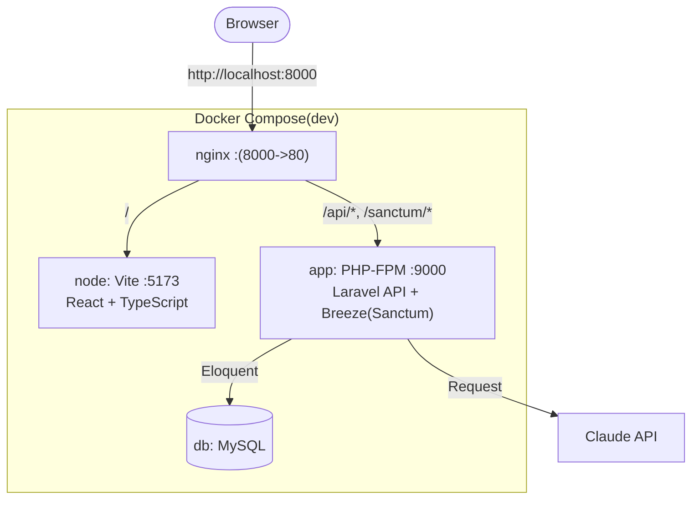

# 構成図

## 開発構成

```mermaid
flowchart TB
    User([Browser])

    subgraph Docker["Docker Compose(dev)"]
        direction TB
        Nginx["nginx :(8000->80)"]
        Vite["node: Vite :5173<br/>React + TypeScript"]
        App["app: PHP-FPM :9000<br/>Laravel API + Breeze(Sanctum)"]
        DB[("db: MySQL")]
    end

    Claude["Claude API"]

    User -->|"http://localhost:8000"| Nginx
    Nginx -->|"/"| Vite
    Nginx -->|"/api/*, /sanctum/*"| App
    App -->|"Eloquent"| DB
    App -->|"Request"| Claude
```
