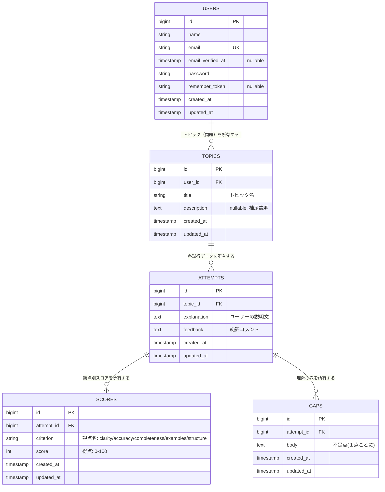

# ER図

```mermaid
erDiagram
    USERS ||--o{ TOPICS : "トピック（問題）を所有する"
    TOPICS ||--o{ ATTEMPTS : "各試行データを所有する"
    ATTEMPTS ||--o{ SCORES : "観点別スコアを所有する"
    ATTEMPTS ||--o{ GAPS : "理解の穴を所有する"

    USERS {
        bigint id PK
        string name
        string email UK
        timestamp email_verified_at "nullable"
        string password
        string remember_token "nullable"
        timestamp created_at
        timestamp updated_at
    }
    TOPICS {
        bigint id PK
        bigint user_id FK
        string title "トピック名"
        text description "nullable, 補足説明"
        timestamp created_at
        timestamp updated_at
    }
    ATTEMPTS {
        bigint id PK
        bigint topic_id FK
        text explanation "ユーザーの説明文"
        text feedback "総評コメント"
        timestamp created_at
        timestamp updated_at
    }
    SCORES {
        bigint id PK
        bigint attempt_id FK
        string criterion "観点名: clarity/accuracy/completeness/examples/structure"
        int score "得点: 0-100"
        timestamp created_at
        timestamp updated_at
    }
    GAPS {
        bigint id PK
        bigint attempt_id FK
        text body "不足点(１点ごとに)"
        timestamp created_at
        timestamp updated_at
    }
```
