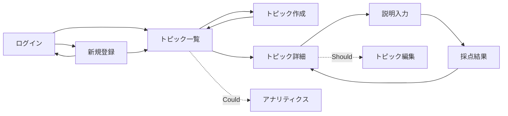

# 画面設計

## 画面一覧

優先度は Must/Should/Could/Won't の4段階(MoSCoW分析)

| 画面名 | ルート | 概要 | 優先度 |
| --- | --- | --- | --- |
| ログイン | `/login` | ユーザー認証 | Must |
| 新規登録 | `/register` | ユーザー新規登録 | Must |
| トピック一覧 | `/topics` | 自分のトピックを一覧表示 | Must |
| トピック作成 | `/topics/new` | 学びたい概念を登録（モーダル可） | Must |
| トピック詳細 | `/topics/{id}` | 試行履歴とスコア推移を確認・挑戦の起点、観点別の推移グラフ(Should) | Must |
| 説明入力 | `/topics/{id}/attempts/new` | 自分の言葉で説明して送信 | Must |
| 採点結果 | `/topics/{id}/attempts/{attemptId}` | 総合点・観点別・フィードバック・理解の穴を表示、観点別レーダーチャート(Should) | Must |
| グローバルナビ（共通） | 全画面共通 | ログアウト・一覧（ログイン後の全画面に表示） | Must |
| トピック編集 | `/topics/{id}/edit` | タイトル・説明の修正（モーダル可） | Should |
| アナリティクス | `/analytics` | 観点別の弱点・頻出ギャップを俯瞰 | Could |

## 画面遷移図

